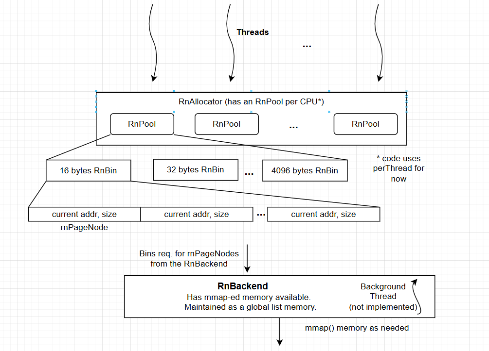

# rnAlloc

## Assignment Description
Implement two (malloc and free) library calls along with a simple allocation policy to perform thread-safe memory allocation and free. Memory should be reserved beforehand (you may use mmap for that) and then managed by your allocator. Try to focus as much as possible on the performance (including the scalability) of the management operations. Include a small benchmark suite that compares your allocator to other memory allocators (at least glibc's malloc()) with various relevant metrics (don't worry too much about the results, its more to see how you think about system design than to actually improve memory allocators :) ). Present your design choices, assumptions or tradeoffs as well as your evaluation in a separate document (for example markdown file).

### Takeaways from the description
1. Two thread-safe APIs providing allocate and free functionalities, respectively.
2. Reserve memory before hand - use mmap(). The allocator manages the memory reserved by mmap().
3. Key KPIs to focus on are performance and scalibility - I take this to be low contention for multiple threads and low overheads.
4. Compare to existing allocators - the ones I know are: glibc, tcmalloc, temeraire (maybe), etc. Search for more and pick appropriate ones.
5. Add a benchmark suite to benchmark against those decided in 4.
6. Document all design choices, decisions, tradeoofs, evaluations, etc.

### Assumptions:
a. In 2. above if the allocations cross the reserved capacity I decide to crash the prgram? I leave a hook in the both the code and design to extend this to request more mmap-ed memory.

---

## rnAlloc: Designing my allocation and free calls by managing reserved memory
### Design Goals:
G1: Thread-safety with minimal overheads. <br>
G2: Efficient space utilization of the reserved memory. <br>
G3: Be highly scalable for larger programs with multiple threads. <br>

### Designing RnAlloc:
Note: Given my basic understanding of tcmalloc's design having used in a past project, my design borrows principles from it [3].

1. RnAllocator:
   The RnAllocator maintains a reference to the perCPU or perThread RnPool (as seen in the Figure 1). The rnAlloc and rnFree calls interface first with the RnAllocator modulle. The RnAllocator simply acts an an indirection layer and based on the cpu_id or thread_id calls the corresponding RnPool. The decision to keep perThread or preCPU structures helps in minimizing the need for locks and in fact almost entirely eliminates it in this layer. For example, keeping a perThread RnPool means that each thread has its own pool of memory to allocate from or free to. However, using a perThread RnPool runs into scalability issues especially for modern applications on systems that end up spawning 100s of threads. Specifically, maintaining a perThread RnPool means that the memory footprint is directly proportional to the number of threads active. <br>

   > **_Note:_** **For large sizes, once could directly obtain memory via the RnBackend instead of relying on the RnPool and RnBins.** 

   An easy way to mitigate this is to maintain a perCPU RnPool. This still provides a fast-path for allocation and freeing. This way, it still remains performant and reduces the overhead of maintaining RnPools because there are a fixed number of CPUs per system. <br>
   > **_Observation:_**  **This design element caters to G1 and G3**

   (View in Dark mode or download the .png separately))
   <figure>
      
      <figcaption style="text-align: center;"> Figure 1. RnAlloc design</figcaption>
   </figure>

1. RnPool:
   The RnPool is a perCPU or perThread pool of memory that can enables a fast-path for allocation and free. The RnPool internally maintains multiple size bins called RnBins. RnBins are similar to size classes in tcmalloc.
   The RnBin allocates memory from the RnBackend in fixed sizes. The RnBin uses a list to track the addresses allocated from its memory available. If the RnBin runs out of memory, it requests the RnBacked for more memory.
   > **_Observation:_**  **By keeping memory in RnBins to provide a fast lockless thread safe allocation path, RnAlloc can achieve low latency.**
   > **_Tradeoff:_**  **Latency vs. Mem Utilization: Deciding how much memory to keep per bin vs the amount used by each thread for a specific bin is a tradeoff in efficient space utilization vs speed of allocation.**
   > **_Tradeoff:_**  **How many bins are needed? For example tcmalloc uses 86-90 bins based on the page size used. This is to be picked to tradeoof performance and space wastage [6].

   (not implemented) RnPool Memory Borrow: The RnBin can borrow memory from other RnBins (inter-bin) and RnPools and borrow memory from other RnPools (inter-pool) to meet bin size access asymmetry. The RnBackend's background thread also requests RnBins and RnPools to release any unused, excess memory to re-distribute to other RnBins and RnPools.
   > **_Tradeoff:_**  **Complexity vs Space Efficiency: While the borrow concept seems complex, it caters various simple scenarios like an application exiting and threads no longer needing an RnPool. Similarly, during low CPU utilizations, it would make sense to release memory to the RnBackemd and uninit/keep minimal RnPools.**

   The RnBin does not use a header structure for its nodes to track metadata. Instead RnAlloc relies on separately maintained metadata. Currently the implementation uses a simple c++ map to trace metadata. However, the ideal implementation should use a radix tree of sorts to keep range based metadata to help fasten free calls.
    > **_Tradeoff:_**  **Latency vs. Mem footprint: Using header based metadata might be more memory efficient but might come at the cost of some latency. A tree based metadata stucture while being higher on memory consumption can improve latency.**
  
4. RnBackend:
   The RnBackend is a global list of memory obtained via mmap(). Currently the mmap() happens on init time to allocate a large slab of memory based on a fixed size. To extend this to make a more generic design, the RnBackend can request more memory via mmap() as and when the global list runs low on available memory to allocate to the RnPools. The global list uses a lock to make sure that there us synchronized allocation of memory if multiple RnPools request memory at the same time.

   The RnBackend maintains metadata of which size bin its memory is being allocated to from the global list. (check 4. Metadata Maintained below)

   (Not implemented) The mmap() call can reserves pages directly from 2MB hugepages if available via the HugeTLBfs [1]. This is because hugepages help in lowering TLB misses by design due to the lower PTEs. One could also try to use larger sizes hugepages like 1GB or other values supported by the platform that RnAlloc runs on. 
   > **_Observation:_**  **This design element helps improve performance by reducing TLB misses**

   (Not implemented) Background Thread - Garbage collector of sorts: This thread keeps a check on memory allocated to each RnPool and RnBin and keeps a check on the best tradeoff between space utilization and latency of memory allocation and free calls.

5. Metadata Maintained:
   The metadata maintained by RnAlloc is simply a map where the key is the address range and value is the binSize. This way even if a CPU different from the one that allocated the memory tries to free it, the metadata map helps obtain the binsize and letes the CPU add that memory back to its corresponding RnBin. (To Do - use a tree for optimal performance and space utilization - maybe a radix tree?)
   > **_Note:_**  **To prove that cross-cpu free and subsequent allocation works fine there is a UT to demonstrate this. Check unit_tests/test_cross_cpu_free.cpp - It has explanation in comments and running it after compilation showcases that cross cpu free actually works fine.**

### Limitations/Deficiencies of the current minimal implementation:
The following are currently not implemented / can be optimized in this minimal working implementation:
1. Coalescing of memory frees in RnBin.
2. Using std::list instead of a self implemented doubly-linked-list.
3. Using a map in multiple places instead of better and efficient data structures.
4. Compile as library as add hooks to malloc and free or new and delete.

## Designing a benchmarking suite: RnBench
RnBench randomly issues alloc or free calls, picks random slots to alloc or free, picks a random size betwee 16, 64, 64, and 128 bytes. RnBench launches multiple threads as specified by the user. The user configurable options are: num_threads, num_slots, and num_iters.
   > **_Flow of RnBench:_**  **Reserve a void* arr with num_slots all assigned to nullptr -> Pick Alloc/Free Op -> Pick random index -> Pick one of the 4 sizes randomly -> If arr[index] is null for an Alloc Op do alloc, if arr[index] is not null for an alloc Op do free. Do this for each thread.**

### KPIs and features that are needed for a memory allocator becnhmark and the current support in RnBench:
KPIs collected by RnBench natively are:
1. Allocation time/latency

(not implemented) Other relevant KPIs that can be collected via perf [2] or other tools: 
2. Memory overhead
3. Cache Misses
4. Instructions executed per CPU
5. Collect flamegraph using perf record - debug/compare any high-latency function calls.

RnBench supports the following currently:
| Support in RnBench  | Supported in RnBench | Comments |
| :-----: | :---: | :---: |
| Multi-threaded | Y | N/A |
| Varying allocation sizes | Y | Currently RnBench randomly picks between uses 4 mem sizes for now (16 bytes, 64 bytes, 128 bytes, and 1024 bytes).|
| Pattern: Seq. Rand., etc. | Y  |  N/A  |
| Memory Allocators | RnAlloc - Y <br> glibc - Y <br> tcmalloc - Y <br> jemalloc - Y |  |

Currently limitations of running rnBench: 
1. Due to low system capabilties available (2 CPUs, 4 GB RAM - using a Digitial Ocean VM), RnBench hasn't been fully tested and verified for high threads + high slots + high iteraations configurations (>16 threads).

Archive of fixes:
Fix 1. Using thread::id::get_id() for comparison is not recommended in c++ - requires a better method in rn_allocator.cpp. Fixed - setting thread name and using that now. 
Fix 2. Remove hardcodings: Calculate the mem required based on slots and threads and compare against free memory before starting benchmark. Fixed, adding calculation - quite conservative estimation.


### Setup
Setup 1: 
1. vCPUs: 2
2. RAM: 4 GB
3. Linux kernel version: 6.11.0-9-generic
4. Ubuntu version: 24.10

Setup 2: To Do -> Run on a Server? **Don't have a setup unfortunately, so I haven't tested**

### Build Directions
mkdir build && && cd build && cmake .. && make && cd - <br>

Run with: ./build/bin/rnBench

rnBench in the bin/ folder is the benchmark that takes in the following options:
1. num_threads
2. num_slots
3. num_iters
4. yes/no for rnAlloc
5. yes/no for malloc

To run with tcmalloc for example, run:
LD_PRELOAD=/usr/lib/x86_64-linux-gnu/libtcmalloc.so ./build/bin/rnBench 4 100000 500000 yes yno

To run with perf stats run:
perf stat ./build/bin/rnBench 2 100000 500000 no yes

### Unit Tests (To Do -> use gtests later)
cd unit_tests/ <br>
./individual_module_tests.sh <br>
cd tests/ <br>
Run the compiled UTs as needed: Currently test_multi and test_all are broken 

### Checking memory errors and leaks with valgrind
````
```
root@roshan-devel:/home/roshan/rnAlloc# valgrind --tool=memcheck --leak-check=yes ./rnBench
==451118== Memcheck, a memory error detector
==451118== Copyright (C) 2002-2024, and GNU GPL'd, by Julian Seward et al.
==451118== Using Valgrind-3.23.0 and LibVEX; rerun with -h for copyright info
==451118== Command: ./rnBench
==451118==
==451118==
==451118== HEAP SUMMARY:
==451118==     in use at exit: 0 bytes in 0 blocks
==451118==   total heap usage: 1,634,112 allocs, 1,634,112 frees, 146,553,640 bytes allocated
==451118==
==451118== All heap blocks were freed -- no leaks are possible
==451118==
==451118== For lists of detected and suppressed errors, rerun with: -s
==451118== ERROR SUMMARY: 0 errors from 0 contexts (suppressed: 0 from 0)
```
````


### Initial Evaluations
Note: RnBench has not been testes with more than 500k iterations due to the above mentioned limitations.

Config used: Rand. sizes of 16, 64, 128, and 256 bytes | 100k available slots to allocate/free and 500k iterations. (Note that these results are with the code as on April 27. Fresh results to follow.)


#### I. Allocations Only:
Time (ms) - Mean ± σ on **Setup 1**
| Lib    | 1 thread |  4 threads |    8 threads  | 16 threads |    
| :----: | :----: | :----: | :----: | :----: |
| tcmalloc |  89    | 213.75 ± 26.29    | 466.25 ± 38.44 | 952.5 ± 204.73  |
| glibc    |  113   | 254.75 ± 13       | 529 ± 35.23    | 1175.25 ± 194.93|
| jemalloc |  85    | 121.75 ± 37.1     | 461.1 ± 23.79  | 882.81 ± 36.22  |
| rnAlloc  |  120   | 308.25 ± 13.12    | 671.25 ± 74.89 | 1460.68 ± 41.96 |

#### II. Combinations of Random Allocations and Frees:
Time (ms) - Mean ± σ on **Setup 1**
| Lib    | 1 thread |  4 threads |    8 threads  | 16 threads |    
| :----: | :----: | :----: | :----: | :----: |
| tcmalloc |   87   | 193 ± 46.98     | 534.12 ± 52.24 | 1057 ± 142.87    |
| glibc    |  120   |  238.75 ± 1.1   | 566.38 ± 41.41 | 1140.31 ± 160.1  |
| jemalloc |  70    |  144.75 ± 40.35 | 433.35 ± 15.45 | 888.25 ± 44.89   |
| rnAlloc  | 190    |  452.25 ± 27.91 | 1005 ± 101.8   | 2486.62 ± 352.65 |

Example output of per stat with rnAlloc (perf stat ./build/bin/rnBench 2 100000 500000 yes no)
 Performance counter stats for './build/bin/rnBench 2 100000 500000 yes no':

            549.52 msec task-clock                       #    1.885 CPUs utilized
                35      context-switches                 #   63.692 /sec
                 1      cpu-migrations                   #    1.820 /sec
              6259      page-faults                      #   11.390 K/sec
        1683867743      cycles                           #    3.064 GHz
         469947048      stalled-cycles-frontend          #   27.91% frontend cycles idle
        2826916132      instructions                     #    1.68  insn per cycle
                                                  #    0.17  stalled cycles per insn
         447344092      branches                         #  814.063 M/sec
           4745211      branch-misses                    #    1.06% of all branches

       0.291544612 seconds time elapsed

       0.511895000 seconds user
       0.035800000 seconds sys

Example output of perf stat with glibc (perf stat ./build/bin/rnBench 2 100000 500000 no yes)
Performance counter stats for './build/bin/rnBench 2 100000 500000 no yes':

            294.70 msec task-clock                       #    1.893 CPUs utilized
                15      context-switches                 #   50.899 /sec
                 0      cpu-migrations                   #    0.000 /sec
              8992      page-faults                      #   30.512 K/sec
         923363210      cycles                           #    3.133 GHz
          93099353      stalled-cycles-frontend          #   10.08% frontend cycles idle
         970275164      instructions                     #    1.05  insn per cycle
                                                  #    0.10  stalled cycles per insn
         134034267      branches                         #  454.816 M/sec
           5145828      branch-misses                    #    3.84% of all branches

       0.155656629 seconds time elapsed

       0.243284000 seconds user
       0.050850000 seconds sys


## References 
[1] https://docs.kernel.org/admin-guide/mm/hugetlbpage.html <br>
[2] https://www.brendangregg.com/perf.html <br>
[3] https://github.com/google/tcmalloc <br>
[4] https://github.com/jemalloc/jemalloc <br> 
[5] https://www.gnu.org/software/libc/ <br> 
[6] https://www.jamesgolick.com/2013/5/19/how-tcmalloc-works.html 

